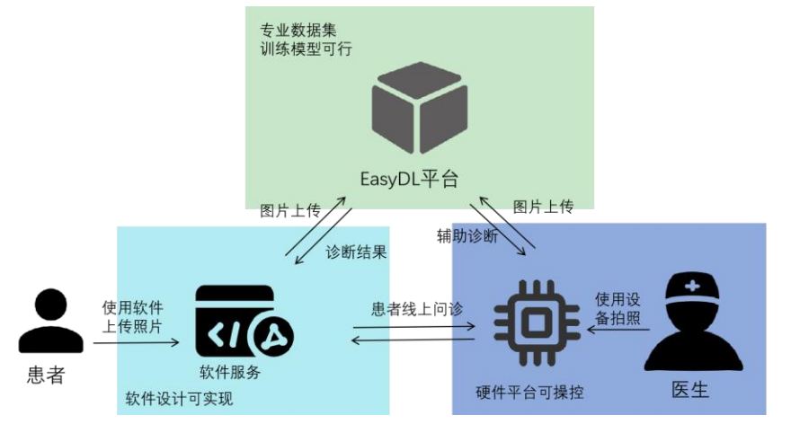
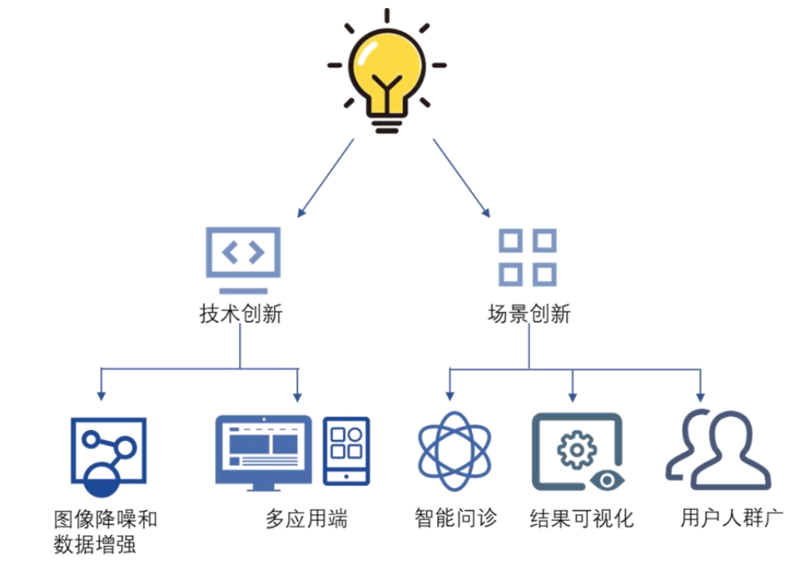
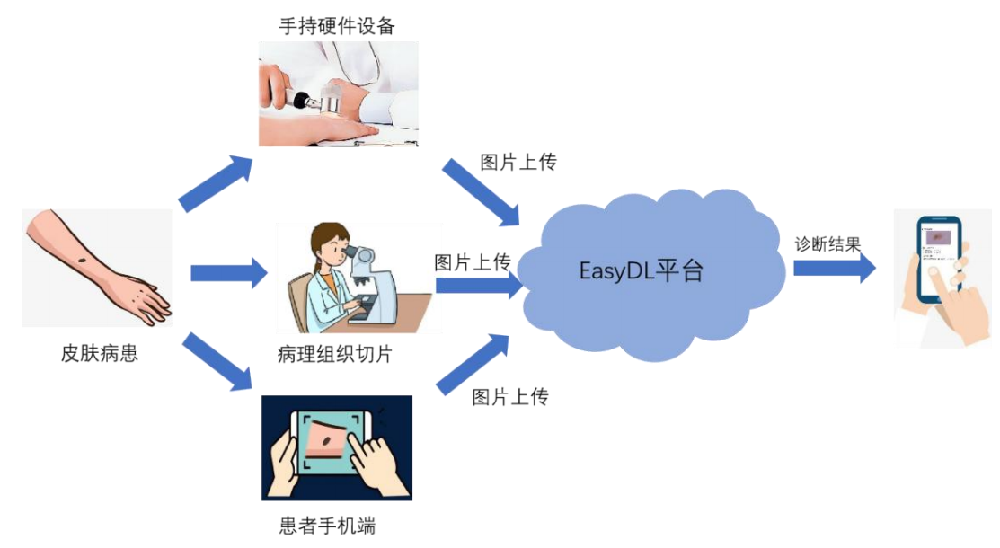
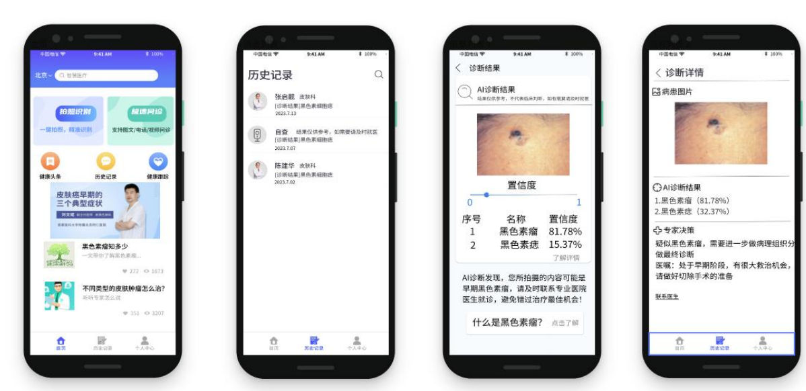
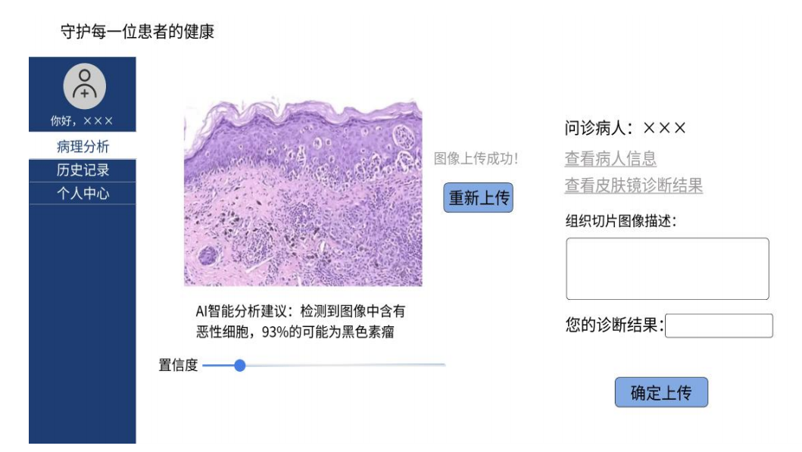
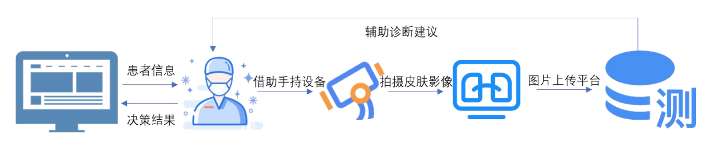
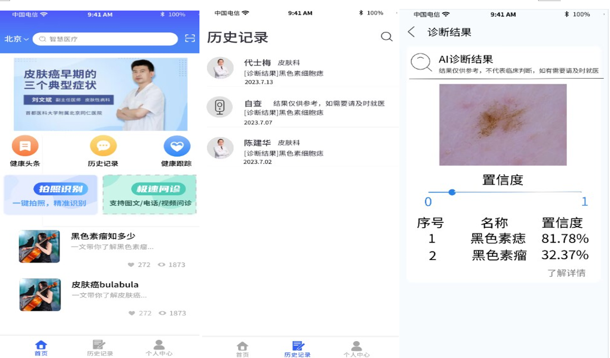

## 带有百度飞桨识别的医疗识别小程序

项目是基于百度EasyDL平台开发的皮肤癌多用户辅助诊断系统，旨在通过图像识别技术帮助医生和患者快速、准确地诊断皮肤癌。项目利用深度学习模型对皮肤镜图像和病理组织切片进行分析，提供诊断结果和治疗建议。系统包括安卓端和Web端，分别面向患者和医生，提升诊断效率，降低医疗成本，具有较高的社会价值和市场推广潜力。

    
     图1 项目可行性

    
     图2 项目创新性

    
     图3 项目整体规划图

    
     图4 安卓页面设计参考

    
     图5 病理Web端诊断

    
     图6 Web端设计流程

    
     图7 小程序界面设计

